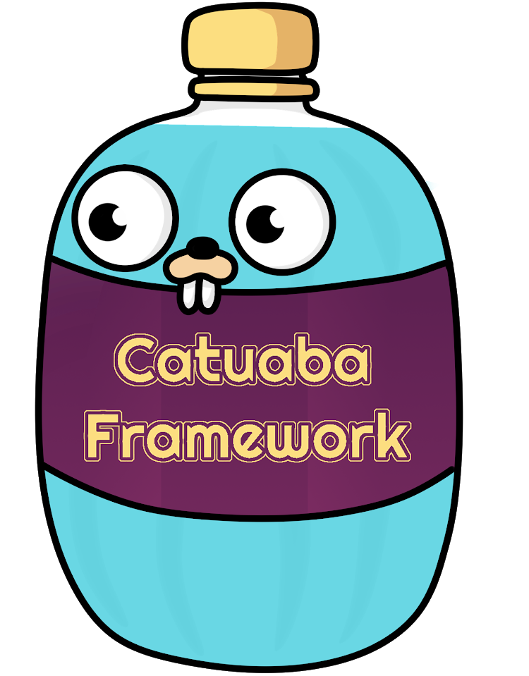
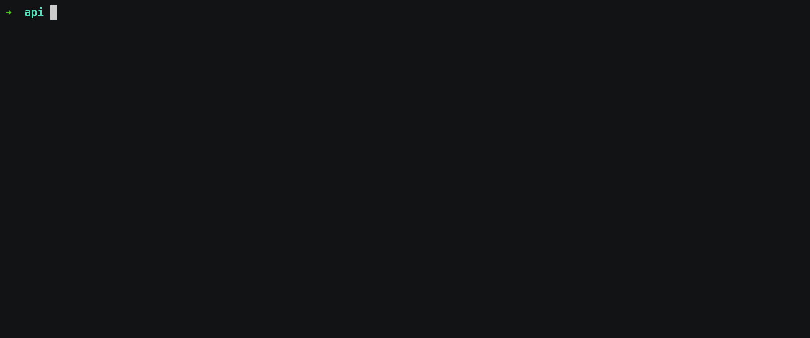

<p align="center"></p>

[](https://actions-badge.atrox.dev/dayvsonlima/catuaba/goto)

# Catuaba Framework

Fast, super productive and aphrodisiac web-framework written in golang


# Setup

Install using go get command
```
go get -u github.com/dayvsonlima/catuaba
```

## On Windows
Install the [tdm-gcc](https://jmeubank.github.io/tdm-gcc/) 

# Command List


| Command | Description | Usage |
| --- | --- | --- |
|--help| provide cli instructions | `catuaba --help`
|new | Create a New project | `catuaba new <project-name>`
|server| Starts the catuaba web server | Run `catuaba server` in the project root
|generator| Call some catuaba generator | `catuaba generator <generator-name> ...<generator-params>`

# Generators List
| Command | Description | Usage |
| --- | --- | --- |
|scaffold| scaffold is a full set of model, controller and router for one RESTFUL resource | `catuaba g scaffold <model-name> ...<attribute:type>`
|model| generates a new model file in `app/models` directory | `catuaba g model <model-name> ...<attribute:type>`
|controller| generates a new controller package in `app/controller` | `catuaba g controller <controller-name> ...<method-name (index, new, create, update, delete, all)>`. if you don't specify the method name, catuaba will create them all by default


