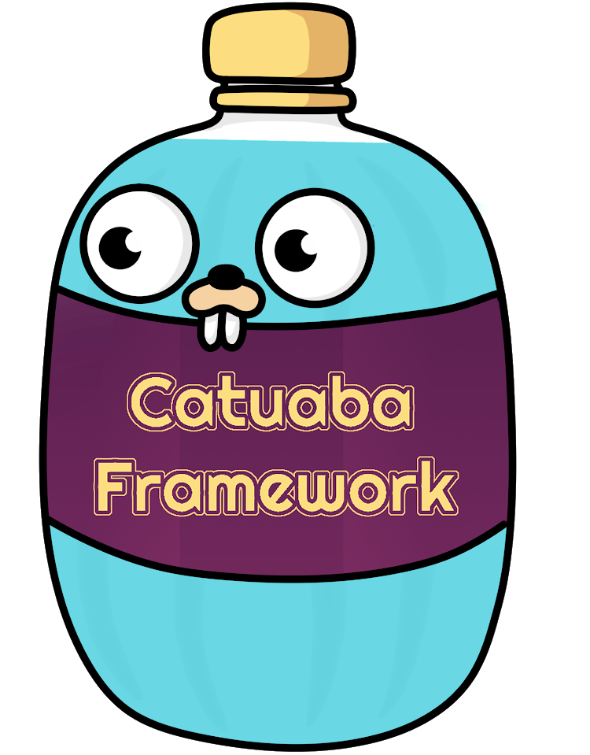
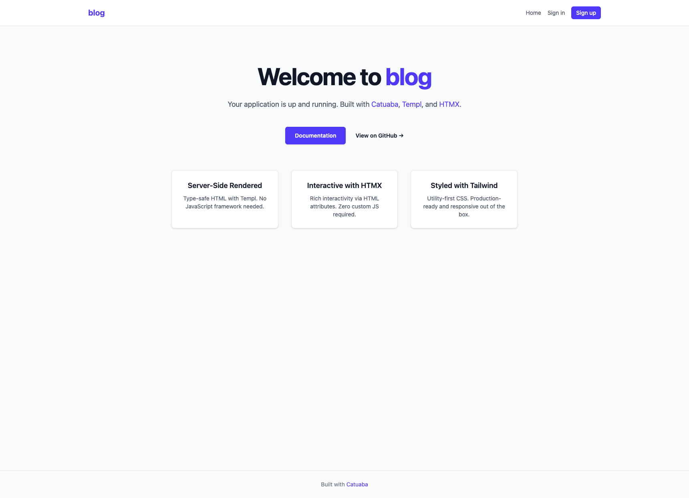
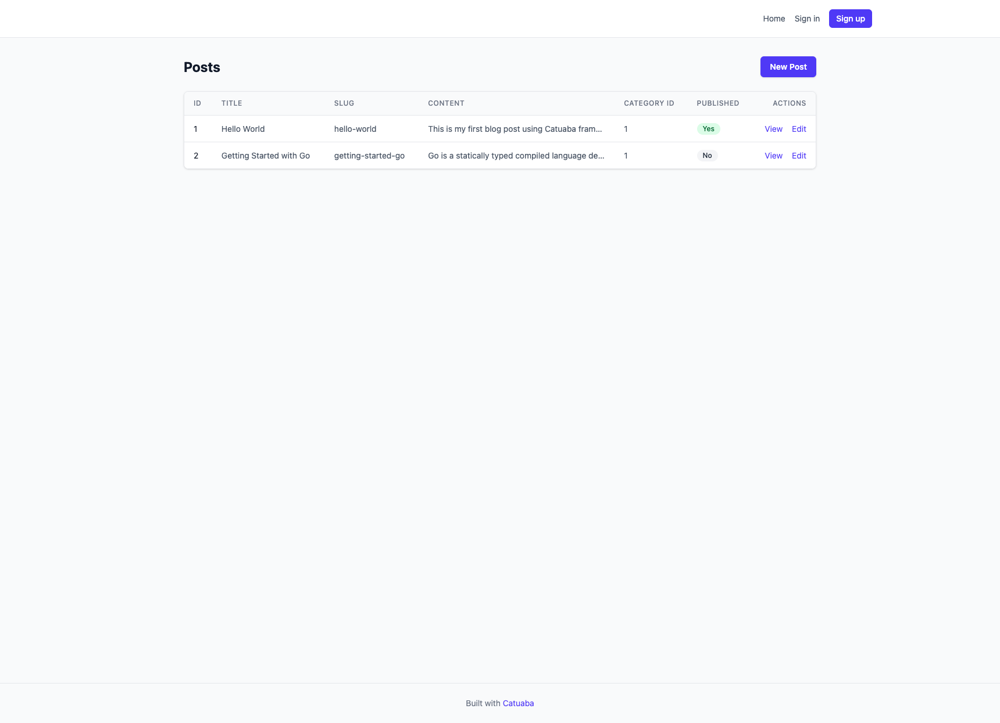
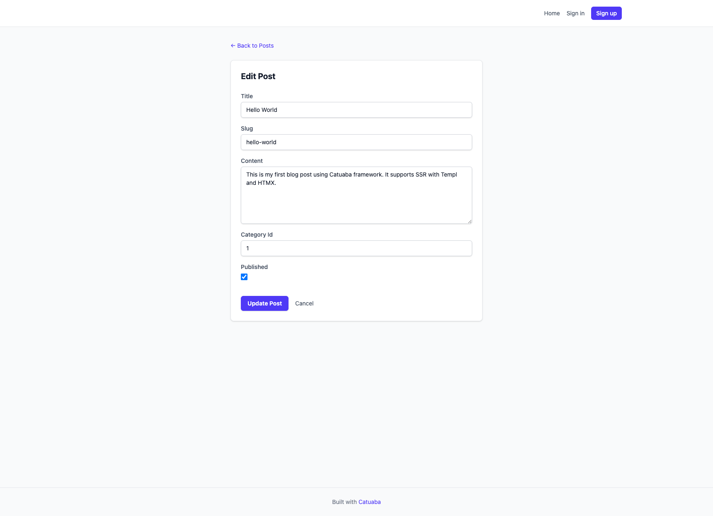
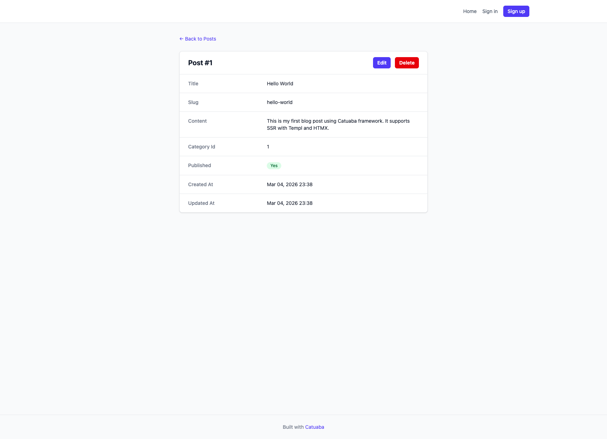
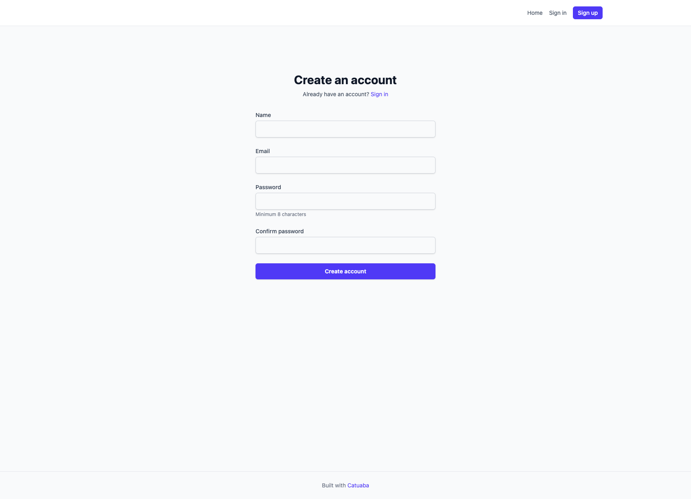
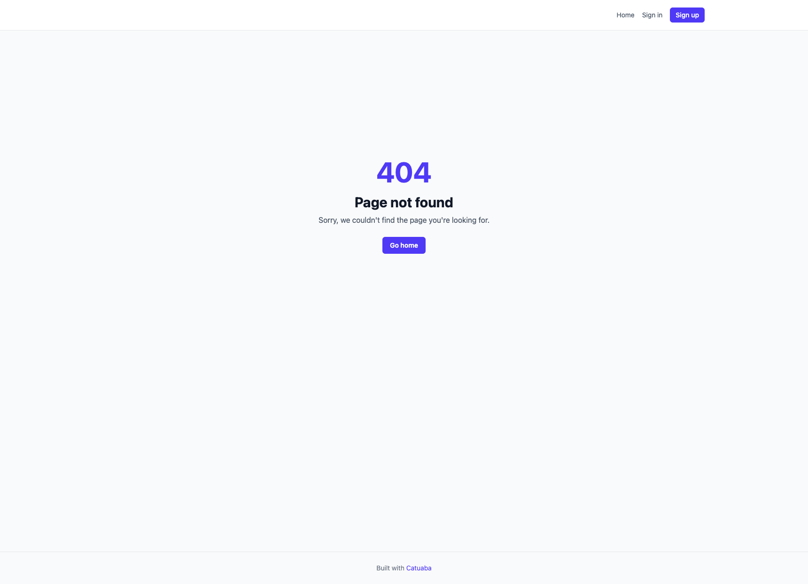

<p align="center"></p>

<h1 align="center">Catuaba</h1>

<p align="center">
  <strong>Build full-stack Go web apps in minutes, not days.</strong>
  <br/>
  <em>The Rails-like framework that Go developers have been waiting for.</em>
</p>

<p align="center">
  <a href="https://github.com/dayvsonlima/catuaba/releases"></a>
  <a href="https://github.com/dayvsonlima/catuaba/actions"></a>
  <a href="https://goreportcard.com/report/github.com/dayvsonlima/catuaba"></a>
  <a href="LICENSE"></a>
</p>

---

Go is fast, simple, and deploys as a single binary. But starting a web project from scratch means wiring up routers, ORMs, templates, auth, CSRF, sessions, migrations, Docker... hours of boilerplate before you write your first feature.

**Catuaba fixes that.** One command gives you a production-ready app. Another gives you a full CRUD with views, API, and database — in seconds.

```bash
catuaba new blog --db postgres --auth
cd blog
catuaba g scaffold Post title:string content:text published:boolean
make dev
```

That's it. You now have a running blog with:

- Landing page styled with **Tailwind CSS**
- Full CRUD for Posts — HTML views **and** JSON API
- User registration and login with **bcrypt + sessions**
- Database migrations, CSRF protection, flash messages
- Hot-reload in development (Templ + Tailwind + Air)
- Docker-ready for production

<br/>

<table>
  <tr>
    <td></td>
    <td></td>
  </tr>
  <tr>
    <td align="center"><em>Generated home page</em></td>
    <td align="center"><em>Scaffold CRUD — posts list</em></td>
  </tr>
  <tr>
    <td></td>
    <td></td>
  </tr>
  <tr>
    <td align="center"><em>Edit form</em></td>
    <td align="center"><em>Post detail view</em></td>
  </tr>
  <tr>
    <td></td>
    <td></td>
  </tr>
  <tr>
    <td align="center"><em>Registration page (--auth)</em></td>
    <td align="center"><em>Custom 404 page</em></td>
  </tr>
</table>

---

## Why Catuaba?

| You want | Catuaba gives you |
|----------|-------------------|
| Start a project fast | `catuaba new myapp` — full app in 3 seconds |
| CRUD without boilerplate | `catuaba g scaffold` — model, views, API, routes, migration |
| Type-safe HTML | [Templ](https://templ.guide/) — compiled templates, IDE autocomplete, no `interface{}` |
| Interactivity without JS frameworks | [HTMX](https://htmx.org/) + [Alpine.js](https://alpinejs.dev/) — 31kb total |
| Production CSS | [Tailwind CSS](https://tailwindcss.com/) — standalone binary, no Node.js |
| Auth that just works | `--auth` — login, register, logout, sessions, bcrypt |
| AI-powered development | Built-in [MCP server](#mcp-server-ai-integration) — Claude/Cursor understand your project |
| Deploy anywhere | Single binary + Docker. That's Go. |

### The Stack

| Layer | Technology |
|-------|-----------|
| HTTP | [Gin](https://gin-gonic.com/) |
| ORM | [GORM](https://gorm.io/) — Postgres, MySQL, SQLite |
| Views | [Templ](https://templ.guide/) — type-safe, compiled HTML |
| Interactivity | [HTMX](https://htmx.org/) + [Alpine.js](https://alpinejs.dev/) |
| CSS | [Tailwind CSS](https://tailwindcss.com/) |
| Sessions | [SCS](https://github.com/alexedwards/scs) |
| Migrations | Raw SQL (up/down) via [golang-migrate](https://github.com/golang-migrate/migrate) |

---

## Install

### Binary (recommended)

**macOS (Apple Silicon)**
```bash
curl -L https://github.com/dayvsonlima/catuaba/releases/latest/download/catuaba-darwin-arm64.tar.gz | tar xz
sudo mv catuaba /usr/local/bin/
```

**macOS (Intel)**
```bash
curl -L https://github.com/dayvsonlima/catuaba/releases/latest/download/catuaba-darwin-amd64.tar.gz | tar xz
sudo mv catuaba /usr/local/bin/
```

**Linux**
```bash
curl -L https://github.com/dayvsonlima/catuaba/releases/latest/download/catuaba-linux-amd64.tar.gz | tar xz
sudo mv catuaba /usr/local/bin/
```

**Windows** — download from [releases](https://github.com/dayvsonlima/catuaba/releases), extract, add to PATH.

### From source

```bash
go install github.com/dayvsonlima/catuaba@latest
```

### Prerequisites

- **Go 1.22+**
- **Templ** — `go install github.com/a-h/templ/cmd/templ@latest`
- **Air** (optional, hot-reload) — `go install github.com/air-verse/air@latest`
- A database: PostgreSQL, MySQL, or SQLite

---

## Getting Started

### 1. Create your app

```bash
catuaba new myapp --db postgres
cd myapp
go mod tidy
```

Flags:
- `--db postgres|mysql|sqlite` (default: postgres)
- `--auth` — adds login, register, logout

### 2. Generate a resource

```bash
catuaba g scaffold Post title:string content:text published:boolean
```

This creates **everything**:

| What | Where |
|------|-------|
| Model | `app/models/post.go` |
| Migration | `database/migrations/*_create_posts.{up,down}.sql` |
| HTML handlers | `app/controllers/posts/` (index, show, new, create, edit, update, delete) |
| Templ views | `app/views/posts/` (index, show, form) |
| JSON API | `app/controllers/api/posts/` (index, show, create, update, delete + tests) |
| Routes | Auto-injected into `config/routes.go` |

### 3. Start developing

```bash
make dev
```

Open `http://localhost:8080` — done.

Three watchers run in parallel:
- **Templ** — recompiles `.templ` files on save
- **Tailwind** — rebuilds CSS on save
- **Air** — rebuilds and restarts the Go server

---

## Generators

All generators run inside your project directory with `catuaba g <generator>`.

### Full-stack scaffold

```bash
catuaba g scaffold Product name:string price:float description:text active:boolean
```

Creates model + migration + HTML handlers + Templ views + JSON API + routes. This is the fastest way to build features.

**HTML routes:**

| Method | Path | Description |
|--------|------|-------------|
| GET | `/products` | List with pagination |
| GET | `/products/new` | New form |
| POST | `/products` | Create |
| GET | `/products/:id` | Detail view |
| GET | `/products/:id/edit` | Edit form |
| POST | `/products/:id` | Update |
| POST | `/products/:id/delete` | Delete |

**JSON API routes:**

| Method | Path |
|--------|------|
| GET | `/api/products` |
| POST | `/api/products` |
| GET | `/api/products/:id` |
| PUT/PATCH | `/api/products/:id` |
| DELETE | `/api/products/:id` |

### API only

```bash
catuaba g api Order total:float status:string
```

Same as scaffold but without HTML views — JSON API only.

### Model

```bash
catuaba g model Category name:string description:text
```

Creates model + SQL migration.

### Other generators

```bash
catuaba g controller Auth login logout           # Controller with methods
catuaba g middleware RateLimit                    # Middleware
catuaba g service EmailSender                    # Service layer
catuaba g seed Posts                             # Database seed
catuaba g migration add_category_id_to_posts     # Empty SQL migration
catuaba g view about                             # Templ page
```

### Field types

| Type | Go | SQL | HTML |
|------|----|-----|------|
| `string` | `string` | `VARCHAR(255)` | text input |
| `text` | `string` | `TEXT` | textarea |
| `integer` | `int` | `INTEGER` | number input |
| `float` | `float64` | `REAL` | number input |
| `boolean` | `bool` | `BOOLEAN` | checkbox |
| `datetime` | `time.Time` | `TIMESTAMP` | datetime-local |

---

## Commands

| Command | Description |
|---------|-------------|
| `catuaba new <name>` | Create application |
| `catuaba g scaffold <name> [fields...]` | Full-stack CRUD |
| `catuaba g api <name> [fields...]` | JSON API |
| `catuaba g model <name> [fields...]` | Model + migration |
| `catuaba g controller <name> [methods...]` | Controller |
| `catuaba g middleware <name>` | Middleware |
| `catuaba g service <name>` | Service |
| `catuaba g seed <name>` | Database seed |
| `catuaba g migration <name>` | SQL migration |
| `catuaba g view <name>` | Templ view page |
| `catuaba server` | Start server |
| `catuaba routes` | List all routes |
| `catuaba db migrate` | Run pending migrations |
| `catuaba db rollback` | Rollback last migration |
| `catuaba db status` | Migration status |
| `catuaba install <plugin>` | Install plugin |
| `catuaba mcp` | Start MCP server |

---

## Project Structure

```
myapp/
├── application.go              # Entrypoint: middleware stack, routes, graceful shutdown
├── Makefile                    # dev, build, test, docker
├── Dockerfile                  # Multi-stage production build
├── docker-compose.yml          # App + database
├── .env                        # Environment variables
├── config/
│   ├── config.go               # Env vars → AppConfig struct
│   └── routes.go               # Routes (auto-managed by generators)
├── database/
│   ├── connection.go           # GORM connection + migration runner
│   └── migrations/             # SQL files (up/down)
├── app/
│   ├── models/                 # GORM models
│   ├── controllers/
│   │   ├── home.go             # Home page
│   │   ├── {resource}/         # HTML handlers (scaffold)
│   │   └── api/{resource}/     # JSON handlers (api/scaffold)
│   └── views/
│       ├── layouts/base.templ  # HTML5 layout: head, nav, flash, footer
│       ├── components/         # Reusable: nav, flash, pagination, form fields
│       ├── pages/              # Static pages: home, 404
│       └── {resource}/         # CRUD views: index, show, form
├── middleware/                  # Full stack (see below)
└── static/css/                 # Tailwind source + compiled output
```

---

## Middleware

Every app comes with a production-ready middleware stack — no configuration needed:

| Middleware | What it does |
|-----------|-------------|
| **Health** | `GET /health` returns 200 |
| **RequestID** | `X-Request-ID` on every response |
| **Logger** | Structured JSON: method, path, status, latency |
| **Recovery** | Catches panics → 500 |
| **SecureHeaders** | HSTS, X-Frame-Options, CSP |
| **CORS** | Configurable via `CORS_ALLOWED_ORIGIN` |
| **RateLimit** | Token bucket: 10 req/s, burst 40 |
| **Session** | SCS cookie sessions |
| **CSRF** | Auto token validation (skips `/api/` routes) |
| **Flash** | Flash messages: success, error, warning |

---

## Authentication

```bash
catuaba new myapp --db postgres --auth
```

Generates a complete auth system:

- `GET /register` — registration form
- `POST /register` — create account
- `GET /login` — login form
- `POST /login` — authenticate
- `POST /logout` — destroy session
- `RequireAuth()` middleware — protects routes, redirects to `/login`

Passwords are hashed with **bcrypt**. Sessions use **SCS** (cookie-based, OWASP-compliant).

---

## Database

### Drivers

| Driver | Flag | Example |
|--------|------|---------|
| PostgreSQL | `--db postgres` | Default. Docker Compose included |
| MySQL | `--db mysql` | Docker Compose included |
| SQLite | `--db sqlite` | Zero config, file-based |

### Migrations

Raw SQL, versioned, up/down:

```bash
# Auto-generated with models and scaffolds
database/migrations/20240101120000_create_posts.up.sql
database/migrations/20240101120000_create_posts.down.sql

# Manual migration
catuaba g migration add_slug_to_posts

# Run / rollback / check
catuaba db migrate
catuaba db rollback
catuaba db status
```

---

## MCP Server (AI Integration)

Catuaba ships with a built-in [MCP](https://modelcontextprotocol.io/) server. AI coding assistants (Claude Code, Cursor, Windsurf) can understand your project structure and generate code — without reading every file.

### Setup

Add to your `.mcp.json` or `claude_desktop_config.json`:

```json
{
  "mcpServers": {
    "catuaba": {
      "command": "catuaba",
      "args": ["mcp"]
    }
  }
}
```

### What the AI gets

**Resources** — your project as compact JSON:

| Resource | Returns |
|----------|---------|
| `catuaba://project/overview` | Module, Go version, DB, port, plugins, directories |
| `catuaba://project/models` | All models with fields, types, tags |
| `catuaba://project/routes` | All routes: method, path, handler |
| `catuaba://project/controllers` | All controllers and functions |
| `catuaba://project/middleware` | All middleware functions |
| `catuaba://project/env` | Env var names (no values) |

**Tools** — generate code through the AI:

| Tool | What it does |
|------|-------------|
| `generate_scaffold` | Full CRUD: model + handlers + views + API + routes |
| `generate_model` | Model + SQL migration |
| `get_model` | Inspect model details |
| `get_routes` | List routes (filterable by prefix) |
| `get_logs` | Recent app logs (filterable by level/path) |
| `run_command` | Run any catuaba generate subcommand |
| `install_plugin` | Install a plugin |

Every generated app also includes a **`CLAUDE.md`** with framework conventions, so AI assistants follow the right patterns automatically.

---

## Plugins

Extend Catuaba with plugins:

```bash
catuaba install stripe-payments             # From registry
catuaba install https://github.com/user/my-plugin  # From git
catuaba install ./local-plugin              # From local path

catuaba plugin list                         # Browse registry
catuaba plugin info stripe-payments         # Details
```

Plugins are defined by a `plugin.yaml` manifest and can add files, inject routes, add imports, insert struct fields, and set environment variables.

---

## Deploy

### Docker (recommended)

```bash
docker compose up -d --build
```

The generated `Dockerfile` is a multi-stage build:
1. Installs Templ + builds templates
2. Builds Tailwind CSS (minified)
3. Compiles Go binary with `-ldflags="-w -s"`
4. Runs on `alpine:3.19` (~15MB image)

### Manual

```bash
make build
./bin/myapp
```

---

## Development

### Make targets

```bash
make dev          # Hot-reload (templ + tailwind + air)
make build        # Production binary
make test         # go test ./...
make tidy         # go mod tidy
make docker-up    # Docker Compose up
make docker-down  # Docker Compose down
```

---

## Contributing

Contributions are welcome!

```bash
git clone https://github.com/dayvsonlima/catuaba.git
cd catuaba
go mod tidy
go test -v ./...
```

1. Fork the repo
2. Create your branch (`git checkout -b feature/my-feature`)
3. Run tests (`go test ./...`)
4. Submit a PR

---

## License

MIT License — see [LICENSE](LICENSE) for details.
